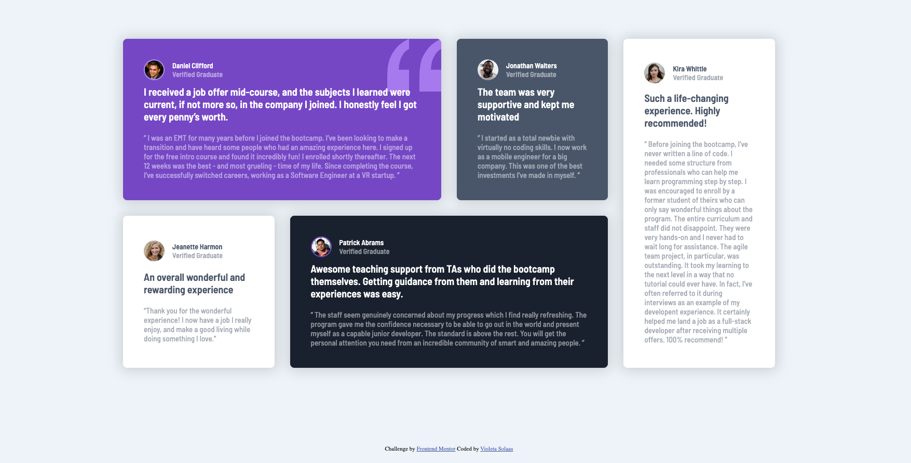

# Frontend Mentor - Testimonials grid section solution

This is a solution to the [Testimonials grid section challenge on Frontend Mentor](https://www.frontendmentor.io/challenges/testimonials-grid-section-Nnw6J7Un7). Frontend Mentor challenges help you improve your coding skills by building realistic projects. 

## Table of contents

## Table of contents

- [Overview](#overview)
  - [The challenge](#the-challenge)
  - [Screenshot](#screenshot)
  - [Links](#links)
- [My process](#my-process)
  - [Built with](#built-with) 
- [Author](#author)

## Overview
Hi!. I have recently ended a css and html course, so i am starting to practice in order to improve my cappabilities in the area.
This is my second challenge and i am very eager to keep progressing..  

### The challenge

Users should be able to:

- View the optimal layout depending on their device's screen size
- See hover states for interactive elements

### Screenshot

### Links

- Solution URL: 

### Built with

- Semantic HTML5 markup
- CSS 
- Grid
- Flexbox

## Author

- Violeta Solaas
- Frontend Mentor - [@Violesol](https://www.frontendmentor.io/profile/Violesol)

